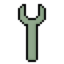

# Alloy Wrench 

一些 ~~研究~~ 折腾机器视觉框架时候用到的 ~~工具~~ 轮子代码.

代码基于 **Java 17**, 依赖 [Topaz 库](https://github.com/FirokOtaku/Topaz), 以 MIT 协议开源.

> _为什么用 Java?_  
> 因为主业是写 Java 的, 写着习惯
> 
> _<del><sub>为什么不用 Java 8?!</sub></del> 为什么是 Java 17?_  
> <del><sub>因为相信的心就是你的魔法</sub></del> 因为乐意
>
> _这一切值得吗?_  
> 能用就行, 哪来那么多毛病
> 
> _图标?_  
> 原图为 [工业时代 - 扳手](https://wiki.industrial-craft.net/index.php?title=Wrench) 的材质

## 用法

```bash
# 神说 要有 jar
mvn package

# 帮助信息
java -jar alloy-wrench-jar-with-dependencies.jar

# 收集 DOTA 数据标签文件里面的标签目标类型
# 整理成一个 json
java -jar alloy-wrench-jar-with-dependencies.jar ^
 collect dota ^
 "./playground/mapping.json" ^
 "./dota-1.0/train/labelTxt" ^
 "./dota-1.0/val/labelTxt"

# 将 DOTA 数据标签文件转换成 YOLO 格式的
# 需要用到上面读取创建的映射 json
java -jar alloy-wrench-jar-with-dependencies.jar ^
 convert dota yolo ^ 
 "./dota-1.0/val/labelTxt" ^
 "./dota-1.0/val/images" ^
 "./playground/mapping.json" ^
 "./playground/val-labels"

java -jar alloy-wrench-jar-with-dependencies.jar ^
 convert dota yolo ^
 "./dota-1.0/train/labelTxt" ^
 "./dota-1.0/train/images" ^
 "./playground/mapping.json" ^
 "./playground/train-labels"

# 将 COCO 数据集转换为 DOTA 格式
java -jar alloy-wrench-jar-with-dependencies.jar ^
 convert coco dota ^
 "./coco-label.json" ^
 "./coco-2-dota-label/"

# 将 labelme 创建的 JSON 数据文件转换为 YOLO 格式的
java -jar alloy-wrench-jar-with-dependencies.jar ^
 convert labelme yolo ^
 "./labelme-labels.json" ^
 "./yolo-labels.txt" ^
 "./mapping.json"

# 将 labelme 创建的 JSON 数据文件转换为 DOTA 格式的
java -jar alloy-wrench-jar-with-dependencies.jar ^
 convert labelme dota ^
 "./labelme-labels.json" ^
 "./dota-labels.txt"

# 切分图片和相关 DOTA 标签数据
# 如果只希望输出切片图片或切片标签
# 需要手动修改代码里的 CutImageTask.OUTPUT_CUT_IMAGE 和 CutImageTask.OUTPUT_CUT_LABEL 值
# 如果需要调整输出图片的大小等参数
# 需要手动修改代码里的 CutImageTask.OVERLYING_X 和 CutImageTask.PIECE_X 等参数
# 为什么用这种方式 因为懒得从代码接收参数了
java -jar alloy-wrench-jar-with-dependencies.jar ^
 cut block ^
 "./raw.png" ^
 "./raw.txt" ^
 "./sub-images" ^
 "./sub-labels"

# 切分图片和相关 COCO 标签数据
# 会把图片里的每个实例单独切分成一张图片
java -jar alloy-wrench-jar-with-dependencie ^
 cut coco ^
 "./super-big/images/" ^
 "./super-big.json" ^
 "./super-big-pieces/" ^
 "./super-big-pieces.json"

# 启动数据标签可视化工具
java -jar alloy-wrench-jar-with-dependencies.jar ^
 renderer dota

# 启动数据标记工具
java -jar alloy-wrench-jar-with-dependencies.jar ^
 marker
```

## 相关链接

* [DOTA 数据集](https://captain-whu.github.io/DOTA/index.html)
* [YOLO 框架](https://github.com/ultralytics/yolov5)
* [labelme 工具](https://github.com/wkentaro/labelme)

## changelog

* 0.13.0
  * add convert from coco label to dota label
* 0.12.0
  * add image cutter tool
* 0.11.0
  * update label marker (unfinished)
* 0.10.0
  * update label marker (unfinished)
* 0.9.0
  * DOTA label renderer now will add points to indicate
    where the polygon starts
  * minor code improvement
  * add label marker (unfinished)
* 0.8.0
  * now we could calculate overlaps
    between labels and cutting area
    when cutting images
* 0.7.0
  * add image-and-labels cutter
* 0.6.0
  * add convert from _labelme_ json to yolo text
  * minor code improvement
  * add Java module support
* 0.5.0
  * reformat help information
* 0.4.0
  * add label viewer GUI
  * minor code improvement
* 0.3.0
  * print more log information
  * update readme
* 0.2.0
  * error fixes
* 0.1.0
  * init commit

## gossip

* DOTA 集里有些打点在图片外, 非常真实
* DOTA 集的标签文件换行符是 `/r/n` 哟
* 突然发现 JavaFX 当 Swing 写也可以嘛
* native-image + JavaFX + --no-fallback = BOOM
* native-image + Swing + --no-fallback = BOOM
